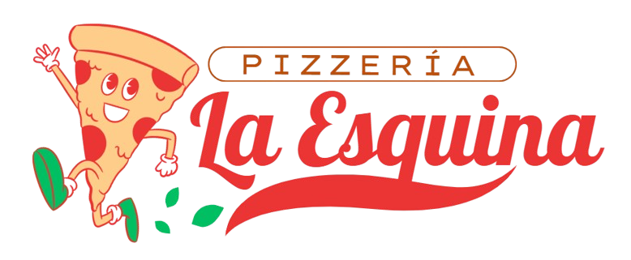
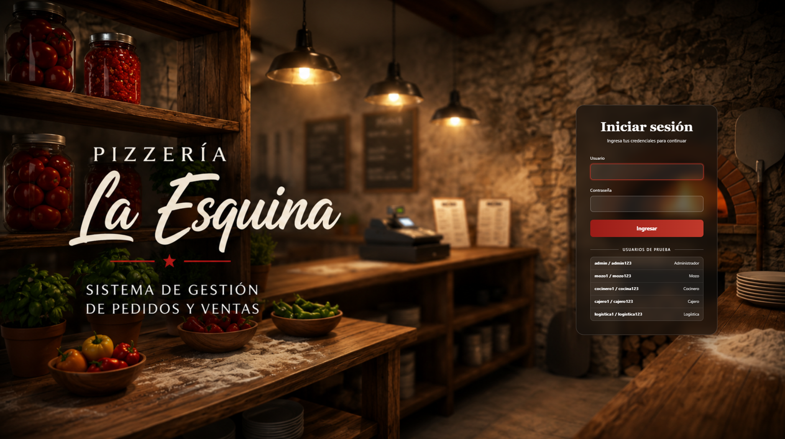
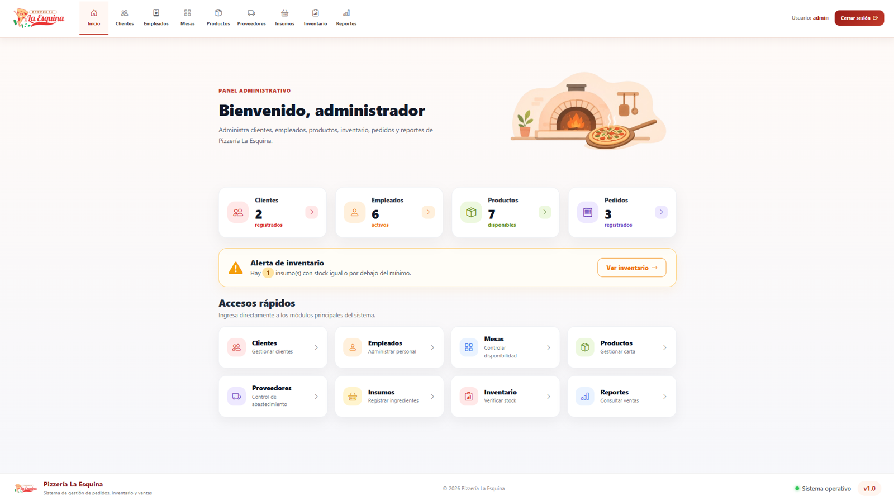
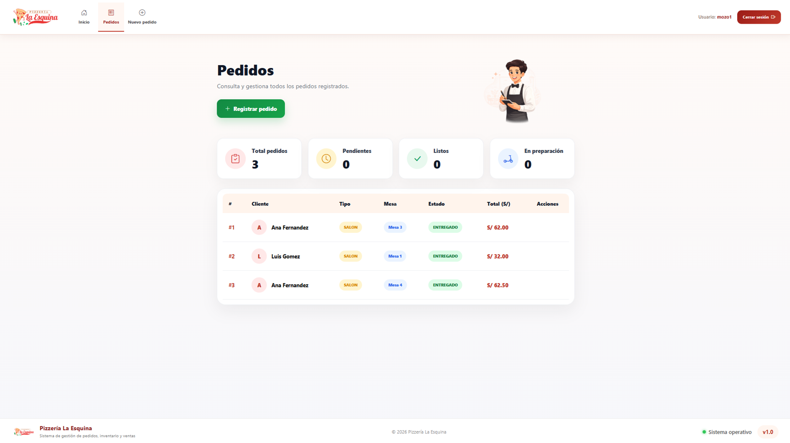
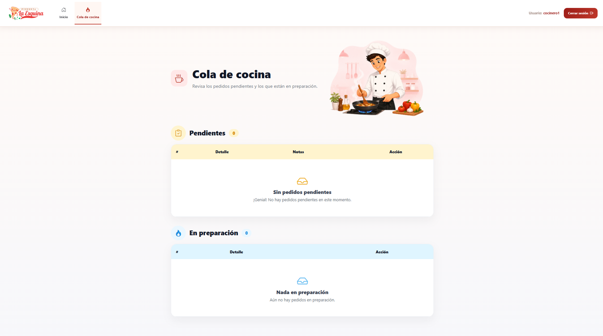
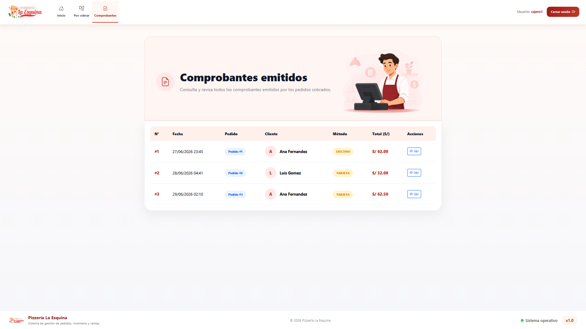
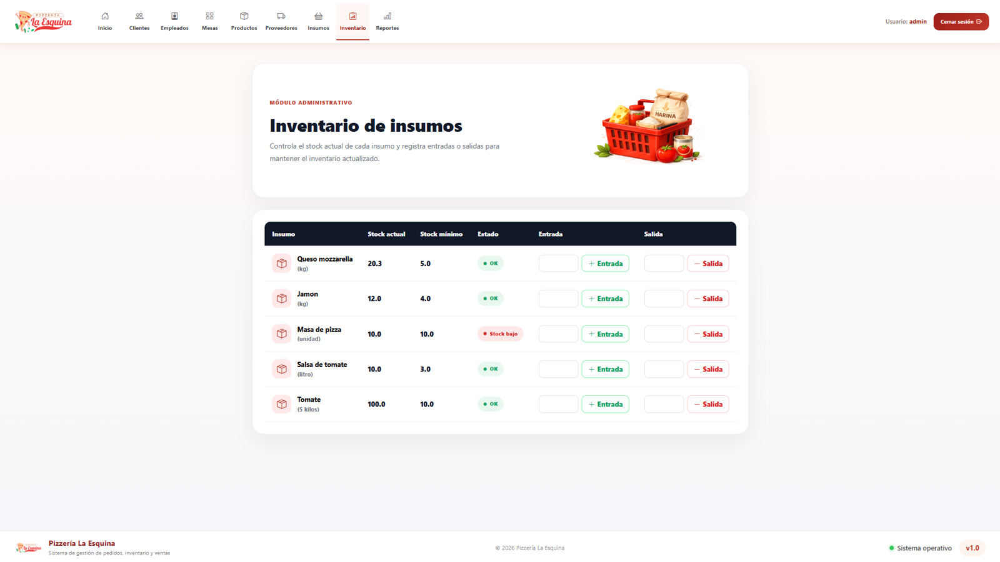
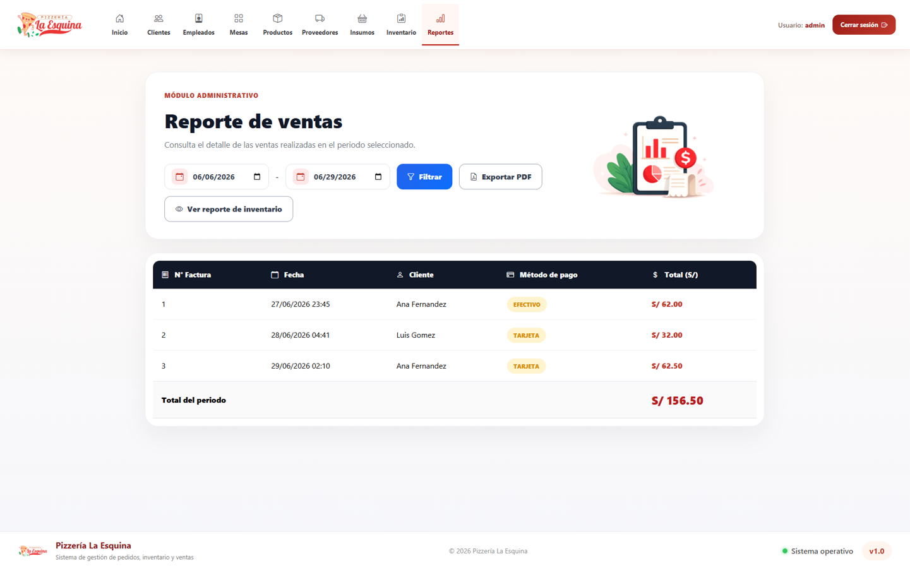

<div align="center">



# 🍕 Sistema de Gestión para Pizzería "La Esquina"

### Plataforma Web para la Gestión Integral de Pedidos, Ventas e Inventario

<p>


</p>

### Sistema desarrollado para optimizar la administración de una pizzería mediante la automatización de pedidos, inventario, ventas y gestión de usuarios.

</div>

---

# 📸 Vista previa

<p align="center">



</p>

---

# 📖 Descripción

**Pizzería La Esquina** es una aplicación web desarrollada utilizando **Java 21** y **Spring Boot**, diseñada para optimizar la gestión de los procesos operativos de una pizzería.

El sistema permite administrar clientes, empleados, productos, proveedores, insumos, inventario, pedidos y facturación desde una única plataforma, incorporando autenticación mediante roles con **Spring Security** para garantizar un acceso seguro a cada módulo.

---

# ✨ Módulos del Sistema

| Módulo | Funcionalidades |
|---------|-----------------|
| 👑 **Administrador** | • Dashboard administrativo<br>• Gestión de clientes<br>• Gestión de empleados<br>• Gestión de productos<br>• Gestión de mesas<br>• Gestión de proveedores<br>• Gestión de insumos<br>• Gestión de inventario<br>• Reportes de ventas e inventario |
| 🍽️ **Mozo** | • Registrar pedidos<br>• Consultar pedidos<br>• Cancelar pedidos<br>• Entregar pedidos |
| 👨🏻‍🍳 **Cocina** | • Visualizar pedidos pendientes<br>• Iniciar preparación<br>• Marcar pedidos como listos |
| 💳 **Cajero** | • Cobrar pedidos<br>• Generar facturas<br>• Consultar comprobantes |
| 📦 **Logística** | • Registrar entradas y salidas de inventario<br>• Controlar stock mínimo |
---

# 👥 Roles del sistema

| Rol | Acceso |
|------|--------|
| 👑 **Administrador** | Gestión completa del sistema y generación de reportes. |
| 🍽️ **Mozo** | Registro, consulta, entrega y cancelación de pedidos. |
| 👨🏻‍🍳 **Cocinero** | Administración del flujo de preparación de pedidos. |
| 💳 **Cajero** | Cobro de pedidos y emisión de comprobantes de pago. |
| 📦 **Logística** | Administración del inventario y control de stock. |

---

# 🏛 Arquitectura

El proyecto fue desarrollado siguiendo el patrón de arquitectura **MVC (Model - View - Controller)**.

```text
📦 com.laesquina.pizzeria
│
├── config
├── controller
├── dto
├── exception
├── model
├── repository
├── service
│
└── PizzeriaApplication
```

---

# 🛠 Stack Tecnológico

<div align="center">


<br><br>


</div>

---

# 🔐 Seguridad

<div align="center">

| Característica | Descripción |
|----------------|-------------|
| 🔑 **Autenticación** | Inicio de sesión mediante Spring Security. |
| 🔒 **Cifrado de contraseñas** | Contraseñas protegidas con BCrypt Password Encoder. |
| 👥 **Autorización** | Acceso controlado según el rol del usuario. |
| 🛡️ **Protección de rutas** | Restricción de acceso a los módulos del sistema. |
| 🚪 **Gestión de sesiones** | Administración segura de la autenticación de usuarios. |

</div>

---

# 📂 Estructura del proyecto

```text
src
│
├── main
│   ├── java
│   │   └── com.laesquina.pizzeria
│   │
│   └── resources
│       ├── static
│       ├── templates
│       └── application.properties
│
└── test
```

---

# 🚀 Instalación

## Clonar el proyecto

```bash
git clone https://github.com/yxdhii/pizzeria-la-esquina.git
```

---

## Acceder al proyecto

```bash
cd pizzeria-la-esquina
```

---

## Configurar la base de datos

Editar el archivo:

```text
src/main/resources/application.properties
```

Ejemplo:

```properties
spring.datasource.url=jdbc:mysql://localhost:3306/pizzeria_la_esquina?createDatabaseIfNotExist=true&useSSL=false&serverTimezone=America/Lima

spring.datasource.username=root

spring.datasource.password=TU_CONTRASEÑA
```

---

## Ejecutar el proyecto

```bash
mvn spring-boot:run
```

o ejecutar directamente la clase:

```text
PizzeriaApplication.java
```

---

# 🌐 Acceso

```
http://localhost:8080
```

---

# 👨🏻‍💻 Usuarios de prueba

Los usuarios iniciales son creados automáticamente mediante la clase **DataInitializer**.

| Rol | Usuario | Contraseña |
|------|----------|------------|
| Administrador | admin | admin123 |
| Cajero | cajero1 | cajero123 |
| Mozo | mozo1 | mozo123 |
| Cocinero | cocinero1 | cocina123 |
| Logística | logistica1 | logistica123 |

---

# 📸 Capturas del sistema

| Inicio de sesión | Dashboard |
|------------------|-----------|
|  |  |

| Registro de pedidos | Módulo de cocina |
|----------------------|------------------|
|  |  |

| Facturación | Inventario |
|-------------|------------|
|  |  |

| Reportes |
|-----------|
|  |
---

# 📈 Funcionalidades Implementadas

- 👥 **Gestión administrativa:** clientes, empleados, productos, mesas, proveedores e insumos.
- 🍕 **Gestión de pedidos:** registro, consulta, entrega y cancelación de pedidos.
- 👨🏻‍🍳 **Módulo de cocina:** preparación y actualización del estado de los pedidos.
- 📦 **Inventario:** control de stock, entradas, salidas y alertas de stock mínimo.
- 💳 **Facturación:** emisión y consulta de comprobantes de pago.
- 📊 **Reportes:** generación de reportes de ventas e inventario.
- 📈 **Dashboard:** visualización de indicadores principales del sistema.
- 🔐 **Seguridad:** autenticación, autorización por roles y protección de rutas.
- ⚠️ **Manejo de errores:** gestión centralizada de excepciones.

---

## 👩🏻‍💻 Desarrollado por

### **Yadhira Patricia Saavedra Guadalupe**

Estudiante de **Ingeniería de Sistemas**  
Universidad Tecnológica del Perú (UTP)

<br>

[](https://www.linkedin.com/in/itsyxdhi/)
[](https://yadhira-portafolio.vercel.app)
[](https://github.com/yxdhii)

<br>

⭐ **Si este proyecto te resultó útil, considera darle una estrella al repositorio.**

© 2026 · Pizzería La Esquina

</div>